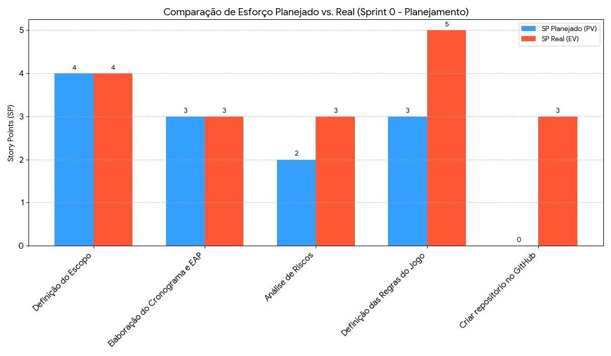

# **Documento de Planejamento e Acompanhamento - Projeto Monopólio Clássico**

**Disciplina:** Ge* **COCOMO (Projeto Simples/Orgânico) =** `$Esforço = 2,4 \times KLOC^{1,05}$`  
    $Esforço = 2,4 \times (8,76)^{1,05} \approx \textbf{22,1 Homens-Mês}$ncia de Projeto e Manutenção de Software

**Equipe:** Alexandre Colmenero, Breno de Carvalho, Erivelton Campos, Gabriel Pinho, João Pedro Barboza e Leonardo Lima.

---

#### **1.0 Escopo do Produto (Requisitos)**

**Requisitos Funcionais (MVP - Primeira Fase):**
* **RF01:** O sistema deve apresentar um tabuleiro digital para 4 entidades.
* **RF02:** O jogo deve suportar de 2 a 4 jogadores humanos em modo "hot-seat".
* **RF03:** Cada jogador será representado por um peão e terá um montante inicial de recursos.
* **RF04:** Um jogador poderá rolar dados e avançar seu peão.
* **RF05:** Ao parar em uma propriedade livre, o jogador terá a opção de comprá-la.
* **RF06:** Ao parar em uma propriedade com dono, o jogador deverá pagar o aluguel.
* **RF07:** O sistema deve gerenciar os recursos de cada jogador.

**Requisitos Funcionais (Pós-MVP - Segunda Fase):**
* **RF08:** O sistema deve incluir uma Inteligência Artificial (IA) para controlar jogadores de PC.
* **RF09:** A IA deve ser capaz de tomar decisões básicas (comprar ou não uma propriedade).
* **RF10:** O sistema deve prover um menu para seleção de modos de jogo:
    * Modo Solo (1 Humano vs. 3 PCs)
    * Modo Multiplayer (2, 3 ou 4 Humanos, com os slots restantes preenchidos por PCs)
    * Modo Espectador (4 PCs)

**Requisitos Não-Funcionais:**
* **RNF01:** A interface do jogo deve ser funcional e clara.
* **RNF02:** O jogo será desenvolvido em Python usando Pygame.
* **RNF03:** O projeto será versionado com Git e hospedado no GitHub.

---

#### **2.0 Escopo do Projeto (Estrutura Analítica do Projeto - EAP)**

* **1.0 Gerenciamento e Planejamento**
    * 1.1 Definição do Escopo
    * 1.2 Elaboração da EAP e Cronograma
    * 1.3 Análise de Riscos
* **2.0 Design do Jogo**
    * 2.1 Definição das Regras do Jogo
    * 2.2 Design de Interface de Usuário (UI) e Experiência do Usuário (UX)
    * 2.3 Design da Lógica da IA

* **3.0 Desenvolvimento do Produto**
    * 3.1 Implementação do Tabuleiro e Movimentação
    * 3.2 Implementação da Lógica das Cartas Sorte e Cofre
    * 3.3 Implementação da Lógica de Propriedades
    * 3.4 Implementação do Sistema de Turnos
    * 3.5 Implementação da Interface Gráfica (HUD)
    * 3.6 Desenvolvimento da Inteligência Artificial (IA)
    * 3.7 Implementação das Condições de Vitória e Derrota
    * 3.8 Criação de Placeholders Visuais

* **4.0 Testes e Validação**
    * 4.1 Testes de Funcionalidades (Multiplayer Local)
    * 4.2 Testes da IA e Modos de Jogo
* **5.0 Entrega**
    * 5.1 Geração das Builds Executáveis
    * 5.2 Elaboração da Documentação e Apresentações

---

#### **3.0 Estimativas de Esforço**

**3.1. Estimativa por Consenso (Planning Poker)**

| Pacote de Trabalho / História de Usuário | Estimativa Final (Story Points) |
| :--- | :---: |
| **1.0 Gerenciamento e Planejamento** |  |
| 1.1 Definição do Escopo | 4 |
| 1.2 Elaboração da EAP e Cronograma | 3 |
| 1.3 Análise de Riscos | 2 |
| **2.0 Design do Jogo** |  |
| 2.1 Definição das Regras do Jogo | 3 |
| 2.2 Design de Interface de Usuário (UI/UX) | 6 |
| 2.3 Design da Lógica da IA | 5 |
| **3.0 Desenvolvimento do Produto** |  |
| 3.1 Implementação do Tabuleiro e Movimentação | 10 |
| 3.2 Implementação da Lógica das Cartas Sorte e Cofre | 8 |
| 3.3 Implementação da Lógica de Propriedades | 8 |
| 3.4 Implementação do Sistema de Turnos | 5 |
| 3.5 Implementação da Interface Gráfica (HUD) | 5 |
| 3.6 Desenvolvimento da Inteligência Artificial (IA) | 14 |
| 3.7 Implementação das Condições de Vitória e Derrota | 5 |
| 3.8 Criação de Placeholders Visuais | 4 |
| **4.0 Testes e Validação** |  |
| 4.1 Testes de Funcionalidades (Multiplayer Local) | 5 |
| 4.2 Testes da IA e Modos de Jogo | 5 |
| **5.0 Entrega** |  |
| 5.1 Geração das Builds Executáveis | 3 |
| 5.2 Elaboração da Documentação e Apresentações | 4 |
| **Total de Esforço Estimado para o Projeto** | **99** |

**3.2. Estimativa Paramétrica (APF/COCOMO)**

* **PFNA (Pontos de Função Não Ajustados):** Considerando todas as funcionalidades (IA, cartas, condições de vitória, interface completa, testes), o PFNA é estimado em aproximadamente **146**.
* **KLOC (vs Python/GDScript @ ~60 LOC/PF) =** 146 \* 60 ≈ **8,76 KLOC**
* **COCOMO (Projeto Simples/Orgânico) =** `$Esforço = 2,4 \times KLOC^{1,05}$`  
    $Esforço = 2,4 \times (8,76)^{1,05} \approx \textbf{22,1 Homens-Mês}$

**3.3. Detalhamento dos Cálculos**

**Passo 1: Cálculo do PFNA (Pontos de Função Não Ajustados)**

Os Pontos de Função são calculados com base em 5 componentes principais:

| Componente | Quantidade | Complexidade | Peso | Subtotal |
|:-----------|:----------:|:------------:|:----:|:--------:|
| **Entradas Externas (EE)** | | | | |
| - Rolar dados | 1 | Simples | 3 | 3 |
| - Comprar propriedade | 1 | Média | 4 | 4 |
| - Pagar aluguel | 1 | Simples | 3 | 3 |
| - Ações das cartas Sorte/Cofre | 1 | Média | 4 | 4 |
| - Configuração inicial do jogo | 1 | Média | 4 | 4 |
| - Seleção de modo de jogo | 1 | Simples | 3 | 3 |
| **Saídas Externas (SE)** | | | | |
| - Atualizar posição do peão | 1 | Simples | 4 | 4 |
| - Exibir informações do jogador | 1 | Média | 5 | 5 |
| - Resultado das cartas | 1 | Média | 5 | 5 |
| - Condições de vitória/derrota | 1 | Complexa | 7 | 7 |
| - Atualização do HUD | 1 | Média | 5 | 5 |
| - Relatórios de transações | 1 | Simples | 4 | 4 |
| - Interface do menu principal | 1 | Média | 5 | 5 |
| **Consultas Externas (CE)** | | | | |
| - Consultar propriedades | 1 | Simples | 3 | 3 |
| - Consultar estado do jogo | 1 | Média | 4 | 4 |
| - Status do jogador atual | 1 | Simples | 3 | 3 |
| - Consultar regras do jogo | 1 | Simples | 3 | 3 |
| **Arquivos Lógicos Internos (ALI)** | | | | |
| - Dados do jogador | 1 | Média | 10 | 10 |
| - Dados das propriedades | 1 | Complexa | 15 | 15 |
| - Estado do tabuleiro | 1 | Média | 10 | 10 |
| - Lógica da IA | 1 | Complexa | 15 | 15 |
| - Configurações do jogo | 1 | Simples | 7 | 7 |
| - Dados das cartas Sorte/Cofre | 1 | Média | 10 | 10 |
| - Sistema de turnos | 1 | Média | 10 | 10 |
| **TOTAL PFNA** | | | | **146** |

**Passo 2: Conversão PFNA → KLOC**

* **Fator de Conversão para Python:** ~60 linhas de código por ponto de função
* **Cálculo:** KLOC = PFNA × Fator de Conversão ÷ 1000
* **KLOC = 146 × 60 ÷ 1000 = 8760 ÷ 1000 = 8,76 KLOC**

**Passo 3: Aplicação do Modelo COCOMO**

**Modelo Utilizado:** COCOMO Básico (Orgânico/Simples)
* **Fórmula:** $Esforço = a \times KLOC^b$
* **Coeficientes para Projeto Orgânico:**
  * a = 2,4 (coeficiente base)
  * b = 1,05 (expoente de escala)

**Cálculo Detalhado:**
1. $KLOC^{1,05} = 8,76^{1,05}$
2. $8,76^{1,05} = 9,186$ (usando logaritmos: $e^{1,05 \times \ln(8,76)}$)
3. $Esforço = 2,4 \times 9,186 = 22,05$
4. **Esforço Final = 22,1 Homens-Mês** (arredondado)

**Justificativa do Modelo Orgânico:**
* Equipe pequena (6 pessoas)
* Problema bem compreendido (jogo clássico)
* Ambiente de desenvolvimento estável (Python)
* Requisitos relativamente estáveis

---

#### **4.0 Custo e Orçamento (Cálculo por Homem-Hora)**

**1. Conversão de Esforço para Homem-Hora:**
* A estimativa de esforço via COCOMO foi de **22,1 Homens-Mês**.
* Considerando um mês de trabalho padrão com 22 dias úteis e 8 horas por dia (1 Mês = 176 horas):
* **Esforço Total em Horas =** 22,1 Meses * 176 Horas/Mês = **3890 Homens-Hora**.

**2. Definição do Custo da Mão de Obra:**
* Adotaremos um valor simbólico para a equipe de desenvolvimento de **R$ 25,00 por Homem-Hora**.

**3. Cálculo do Custo Total:**
* **Custo Total do Projeto =** Esforço Total em Horas * Valor da Hora
* Custo Total = 3890 Horas * R$ 25,00/Hora = **R$ 97.250,00**

**4. Definição do Orçamento:**
* O orçamento é o custo total acrescido de uma margem de 15% para contingências.
* **Orçamento Total =** Custo Total * 1,15
* Orçamento Total = R$ 97.250,00 * 1,15 = **R$ 111.838,00**

---

#### **5.0 Cronograma - Realista com Datas da Disciplina**

**5.1. Sprints**

| ID | Atividade / Sprint | Duração | Início | Fim | Marcos / Entregas Importantes |
| :-- | :--- | :--- | :--- | :--- | :--- |
| 1 | **Sprint 0: Planejamento** | 4 sem | 26/08/25 | 22/09/25 | Prova 1 (18/09). Documento de Planejamento concluído. |
| 2 | **Sprint 1: MVP "Peão que Anda"** | 1 sem | 22/09/25 | 29/09/25 | **Primeira Apresentação dos Trabalhos (30/09)** |
| 3 | **Sprint 2: Propriedades e Turnos** | 2 sem | 01/10/25 | 14/10/25 | Aula de Git (16/10). |
| 4 | **Sprint 3: Desenvolvimento da IA** | 2 sem | 15/10/25 | 27/10/25 | **Segunda Apresentação dos Trabalhos (28/10)** |
| 5 | **Sprint 4: Integração da IA** | 2 sem | 29/10/25 | 11/11/25 | Carga de trabalho reduzida (semana da Prova 2 - 13/11). |
| 6 | **Sprint 5: Polimento e Testes Finais**| 2 sem | 12/11/25 | 24/11/25 | **Terceira Apresentação Final (25/11)** |

**5.2. Gantt**

| ID | Atividade | Duração | Dependência | Início Mínimo | Término Mínimo | Início Máximo | Término Máximo | Folga
| :---: | :---: | :---: | :---: | :---: | :---: | :---: | :---: | :---: |
| 1.1  | Definição do Escopo | 4 | — | 0 | 4 | 0 | 4 | 0 |
| 1.2  | EAP e Cronograma | 3 | 1.1 | 4 | 7 | 41 | 44 | 37 |
| 1.3  | Análise de Riscos | 2 | 1.1  | 4 | 6 | 44 | 46 | 40 |
| 2.1  | Definição das Regras | 3 | 1.1 | 4 | 7 | 4 | 7 | 0 |
| 2.2  | Design de UI/UX | 6 | 2.1 | 7 | 13 | 7 | 13 | 0 |
| 2.3  | Design da IA | 5 | 2.1 | 7 | 12 | 27 | 32 | 20 |
| 3.1  | Tabuleiro e Movimentação | 10 | 2.1, 3.8 | 17  | 27 | 17 | 27 | 0 |
| 3.2  | Lógica das Cartas | 8 | 2.1 | 7 | 15 | 38 | 46 | 31 |
| 3.3  | Lógica de Propriedades | 8 | 2.1 | 7 | 15 | 33 | 41 | 26 |
| 3.4  | Sistema de Turnos | 5 | 3.1 | 27 | 32 | 27 | 32 | 0 |
| 3.5  | HUD | 5 | 2.2 | 13 | 18 | 41 | 46 | 28 |
| 3.6  | IA | 14 | 2.3, 3.1, 3.4 | 32 | 46 | 32 | 46 | 0 |
| 3.7  | Condições de Vitória/Derrota | 5 | 3.3, 3.4 | 32 | 37 | 41 | 46 | 9 |
| 3.8  | Placeholders Visuais | 4 | 2.2 | 13 | 17 | 13 | 17 | 0 |
| 4.1  | Testes Funcionalidades | 5 | 3.1 até 3.5, 3.7 | 37 | 42 | 46 | 51 | 9 |
| 4.2  | Testes da IA | 5 | 3.6 | 46 | 51 | 46 | 51 | 0 |
| 5.1  | Builds Executáveis | 3 | 4.1, 4.2 | 51 | 54 | 51 | 54 | 0 |
| 5.2  | Documentação e Apresentações | 4 | 5.1 | 54 | 58 | 54 | 58 | 0 |

**Caminho Crítico (CPM):** 1.1 → 2.1 → 2.2 → 3.8 → 3.1 → 3.4 → 3.6 → 4.2 → 5.1 → 5.2

*Gráfico 1: Gráfico Gantt*

---

#### **6.0 Análise de Riscos (Versão Completa e Categorizada)**

---

**R1: Indisponibilidade da equipe durante o período de provas.**
* **Probabilidade:** 80% (Alta)
* **Impacto:** 0.9 (Crítico)
* **Exposição (P\*I):** 0.72
* **Prioridade:** **CRÍTICA**
* **Plano de Contenção (Prevenção):** Planejar Sprints mais leves (com menos Story Points) durante as semanas de provas, conforme identificado no cronograma.
* **Plano de Contingência (Remediação):** Reduzir o escopo do Sprint afetado, focando em tarefas de correção em vez de novas funcionalidades.

**R2: Prazo curto para desenvolver a 1ª versão parcial do produto.**
* **Probabilidade:** 90% (Muito Alta)
* **Impacto:** 0.8 (Crítico)
* **Exposição (P\*I):** 0.72
* **Prioridade:** **CRÍTICA**
* **Plano de Contenção (Prevenção):** Reduzir o escopo do Sprint 1 para o mínimo absoluto (o "peão que anda"). Paralelizar o trabalho entre todos os 6 membros da equipe.
* **Plano de Contingência (Remediação):** Caso o código não esteja 100% funcional, focar em demonstrar a parte que funciona e apresentar a excelente qualidade da documentação de planejamento. Ter vídeos e screenshots da última versão estável preparados como backup.

---

**R3: Desenvolvimento da IA é mais complexo que o estimado.**
* **Probabilidade:** 60% (Alta)
* **Impacto:** 0.9 (Crítico)
* **Exposição (P\*I):** 0.54
* **Prioridade:** **CRÍTICA**
* **Plano de Contenção (Prevenção):** Definir um conjunto de regras de decisão para a IA bem simples no início (ex: "se tiver dinheiro, sempre compre"). Focar em fazer a IA funcionar (tomar ações válidas), não em ser "inteligente" ou estratégica.
* **Plano de Contingência (Remediação):** Se a IA complexa falhar, entregar o jogo com uma IA "burra" que apenas rola os dados e executa a ação mais óbvia. Isso garante que os modos de jogo funcionem, mesmo que com baixo desafio.

**R4: Conflitos de versão no Git (Merge Hell) que corrompem o código.**
* **Probabilidade:** 50% (Média)
* **Impacto:** 0.5 (Médio)
* **Exposição (P\*I):** 0.25
* **Prioridade:** **ALTA**
* **Plano de Contenção (Prevenção):** Adotar uma política clara de Git Flow: 1. Trabalhar em `branches` separadas para cada funcionalidade. 2. Sempre executar `git pull` na `branch` principal antes de iniciar uma nova tarefa. 3. Realizar a junção (`merge`) com a ajuda de outro membro da equipe (revisão em pares).
* **Plano de Contingência (Remediação):** Utilizar o comando `git revert` para desfazer um commit problemático sem apagar o histórico, permitindo que a equipe analise o erro e o corrija em uma nova `branch`.

---

**R5: Saída de 1 membro da equipe (perda de 17% da força de trabalho).**
* **Probabilidade:** 30% (Média)
* **Impacto:** 0.8 (Alto)
* **Exposição (P\*I):** 0.24
* **Prioridade:** **ALTA**
* **Plano de Contenção (Prevenção):** Garantir o compartilhamento de conhecimento através de documentação e `code reviews`. Exigir que todo o trabalho seja enviado ao repositório do Git diariamente para evitar perda de código.
* **Plano de Contingência (Remediação):** Realizar uma reunião de replanejamento de emergência. Remover tarefas do Sprint atual e do Product Backlog para ajustar o escopo à nova velocidade da equipe. Redistribuir as responsabilidades do membro que saiu.

**R6: Saída de 2 membros da equipe (perda de 33% da força de trabalho).**
* **Probabilidade:** 10% (Baixa)
* **Impacto:** 1.0 (Catastrófico)
* **Exposição (P\*I):** 0.10
* **Prioridade:** **MÉDIA** (A prioridade matemática é média devido à baixa probabilidade, mas o impacto, se ocorrer, é altíssimo).
* **Plano de Contenção (Prevenção):** Mesmos planos do R5. O Scrum Master deve monitorar ativamente o engajamento e a satisfação da equipe para identificar problemas de forma precoce.
* **Plano de Contingência (Remediação):** Renegociar drasticamente o escopo do projeto com o professor. Funcionalidades complexas como a IA seriam removidas. A viabilidade de continuar o projeto seria reavaliada pela equipe restante.

**R7: Falha na comunicação e desalinhamento entre os membros da equipe.**
* **Probabilidade:** 60% (Alta)
* **Impacto:** 0.7 (Alto)
* **Exposição (P\*I):** 0.42
* **Prioridade:** **ALTA**
* **Plano de Contenção (Prevenção):** Realizar as Daily Meetings obrigatoriamente. Manter um quadro de tarefas virtual (Trello, GitHub Projects) como fonte única da verdade sobre o andamento.
* **Plano de Contingência (Remediação):** Se um desalinhamento for detectado, o Scrum Master deve convocar uma reunião de emergência de 15 minutos com os envolvidos para esclarecer a tarefa.

**R8: Distribuição desigual de trabalho, sobrecarregando um ou dois membros.**
* **Probabilidade:** 50% (Média) 
* **Impacto:** 0.7 (Alto) 
* **Exposição:** 0.35 
* **Prioridade:** **ALTA**
* **Plano de Contenção:** Usar o quadro de tarefas para visualizar a carga de cada um. Incentivar a programação em dupla.
* **Plano de Contingência:** O Scrum Master deve facilitar a redistribuição de tarefas se um membro estiver sobrecarregado.

---

#### **7.0 Monitoramento e Controle**

* **Gráfico de Burndown:** Será gerado ao final de cada Sprint para monitorar o progresso do trabalho restante versus o tempo.
* **Análise de Valor Agregado (AVA):** Será calculada ao final de cada Sprint para comparar o trabalho realizado (EV) com o planejado (PV) e o custo (AC), gerando os indicadores SPI e CPI.

*Gráfico 2: Comparação de Esforço (Sprint 0)*

*Gráfico 3: Indicadores de Desempenho e Conclusão da Perfomance*

---

#### **8.0 Versão Parcial do Produto (Para a 1ª Entrega)**

A primeira entrega consiste no resultado do **Sprint 1**, que é o MVP mínimo para demonstrar o conceito.
* Um projeto Python funcional e versionado no Git.
* A cena do tabuleiro com placeholders visuais e marcadores de posição.
* A cena do peão do jogador.
* O HUD com o botão de "Rolar Dado" e o label de resultado.

* **Funcionalidade Principal:** O jogador pode clicar no botão, e o peão se move corretamente pelo tabuleiro, dando a volta quando necessário.

---

#### **9.0 Plano e organização da equipe**

#### 1. Papel de Cada Membro

A divisão de papéis e responsabilidades foi definida com base nas afinidades e contribuições iniciais de cada integrante durante a fase de planejamento.

* **Leonardo Lima (Gerente de Projeto / Product Owner):** Responsável por gerenciar o quadro de tarefas no Jira, organizar o backlog do produto, garantir que os entregáveis estejam alinhados com os objetivos e manter a documentação do projeto atualizada.
* **Gabriel Pinho (Desenvolvedor Principal):** Lidera a implementação da lógica central do jogo e da interface gráfica, definindo as regras de negócio diretamente no código e garantindo a funcionalidade do produto.
* **Erivelton Campos (Scrum Master / Analista de Planejamento):** Responsável por facilitar a organização da equipe, definir e acompanhar o cronograma, e analisar métricas de progresso do projeto, como a análise de valor agregado.
* **João Pedro Barboza (Dev/DevOps):** Encarregado de configurar e manter a infraestrutura de desenvolvimento, incluindo a criação e gerenciamento do repositório no GitHub, além de prestar suporte geral à equipe.
* **Breno de Carvalho (Analista de Projeto):** Focado na elaboração de artefatos de planejamento detalhados, como a definição do caminho crítico e a criação do gráfico de Gantt para visualização do cronograma.
* **Alexandre Colmenero (Analista de Requisitos e Estimativas):** Responsável por definir o escopo inicial do projeto e realizar as estimativas de esforço, como o cálculo utilizando o modelo COCOMO.

---

#### 2. Duração e Entregáveis de Cada Iteração (Sprint)

O projeto foi dividido em 6 iterações (Sprints), cada uma com um objetivo e um entregável claro.

* **Sprint 0: Planejamento (Duração: 4 semanas)**
    * **Entregável Principal:** Conclusão do Documento de Planejamento do Projeto (EAP, cronograma, análise de riscos, etc.) e configuração inicial do ambiente de trabalho.

* **Sprint 1: MVP "Peão que Anda" (Duração: 1 semana)**
    * **Entregável Principal:** Uma janela funcional em Pygame que exibe o tabuleiro, um peão, e um botão "Rolar Dados". Ao clicar no botão, o peão se move pelo tabuleiro.

* **Sprint 2: Propriedades e Turnos (Duração: 2 semanas)**
    * **Entregável Principal:** Implementação da lógica de compra de propriedades e sistema de turnos. O controle passa para o próximo jogador após a jogada.

* **Sprint 3: Desenvolvimento da IA (Duração: 2 semanas)**
    * **Entregável Principal:** Uma versão inicial da IA que consegue rolar os dados, se mover e tomar a decisão de comprar uma propriedade.

* **Sprint 4: Integração da IA e Modos de Jogo (Duração: 2 semanas)**
    * **Entregável Principal:** O jogo suporta a configuração de uma partida com jogadores humanos e jogadores controlados pela IA.

* **Sprint 5: Polimento e Testes Finais (Duração: 2 semanas)**
    * **Entregável Principal:** Versão final do jogo, com testes realizados, bugs conhecidos corrigidos e pronta para a apresentação final.

---

#### 3. Plano de Reuniões de Equipe

Para garantir o alinhamento contínuo, a comunicação e o bom andamento do projeto, a equipe estabeleceu um plano de reuniões recorrentes.

* **Reunião:** Sincronização Semanal (Weekly Sync)
* **Plataforma:** Discord
* **Frequência:** Todas as semanas
* **Duração Média:** 2 horas
* **Objetivos:**
    * **Acompanhamento:** Cada membro apresenta o progresso das tarefas designadas na semana anterior.
    * **Identificação de Bloqueios:** Espaço para discutir quaisquer dificuldades ou impedimentos que estejam travando o progresso de algum membro.
    * **Planejamento:** Com base no andamento e no backlog, são distribuídas e detalhadas as tarefas para a semana seguinte.
    * **Alinhamento Geral:** Garantir que todos os membros da equipe compartilhem da mesma visão sobre as prioridades e os próximos passos do projeto.
